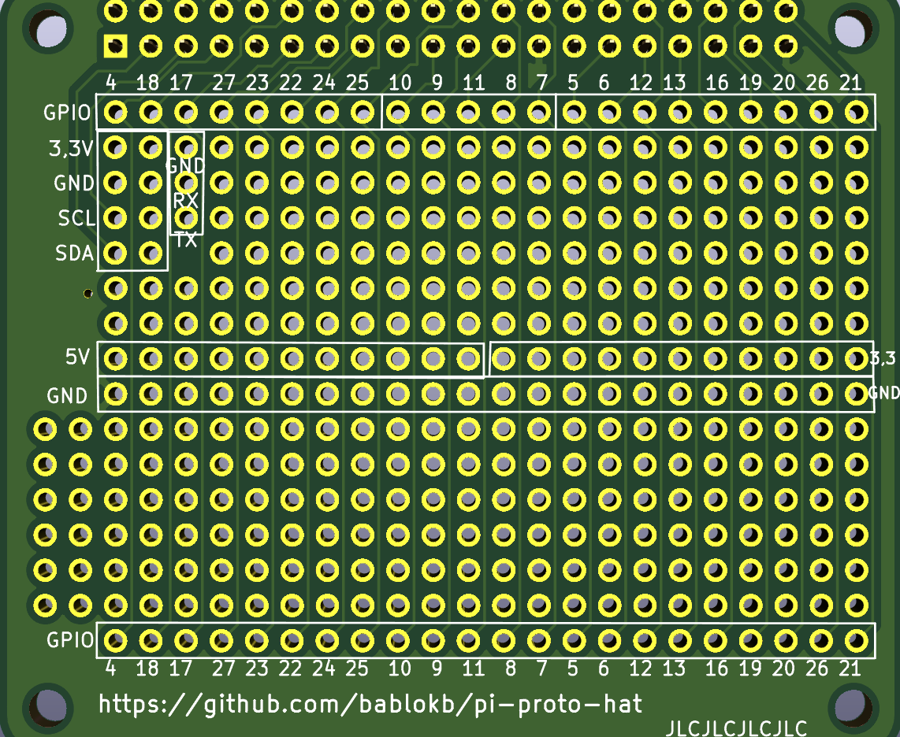

Pi-Proto-Hat
============

This is a PCB design for a Pi-sized prototyping hat:

The hat has a 40-pin connector for the Pi and exposes most of the GPIOs
on the top and bottom edge. On the left side you will find two connectors
for I2C and one for the UART-pins.

In the middle of the pcb there are two rows with power (5V and 3.3V) and
GND. The pins of the prototyping areas above and below the power-rails
are not connected.

In the directory `kicad/pi-proto-hat` you will find the complete
KiCAD project for the hat. The hat has been successfully produced
(by JLCpcb.com).
